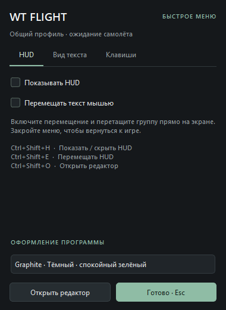
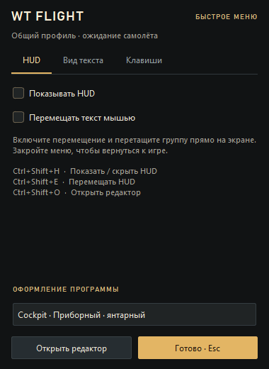
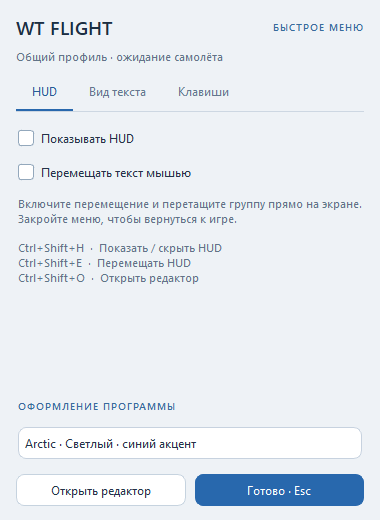
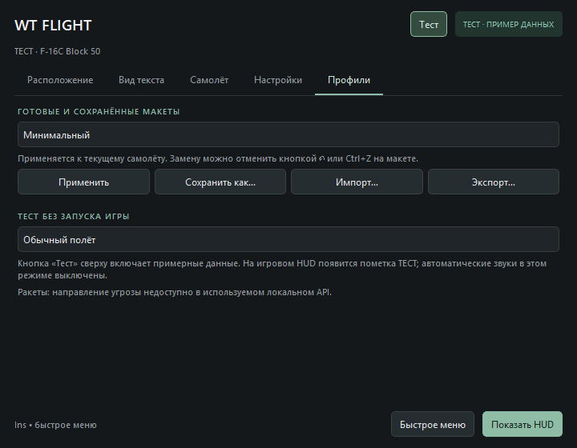

<div align="center">


# WT Flight Assistant

**Настраиваемый HUD и редактор оверлея для авиареалистичных боёв War Thunder на Windows**

[](https://github.com/aelz1233/WTTool/actions/workflows/ci.yml)
[](https://github.com/aelz1233/WTTool/releases)


[Скачать](https://github.com/aelz1233/WTTool/releases) ·
[Возможности](#возможности) ·
[Быстрый старт](#быстрый-старт) ·
[Горячие клавиши](#горячие-клавиши) ·
[Разработка](#разработка) ·
[English](#english)


</div>

---

WT Flight Assistant автоматически подключается к локальному API игры `127.0.0.1:8111`, читает `/state` и `/indicators`, показывает выбранные параметры поверх игры и **не изменяет файлы, память или сетевой трафик War Thunder**.

Проект сделан под компактное окно редактора и игровой HUD в стиле WTRTI: короткие подписи, тонкий текст с обводкой, свободное расположение групп, готовые пресеты, свои профили, горячие клавиши и настраиваемые предупреждения.

> [!IMPORTANT]
> **War Thunder должен работать в оконном режиме или в режиме «окно без рамки».** Обычный внешний оверлей Windows может не отображаться поверх эксклюзивного полноэкранного режима.

> [!NOTE]
> **Важно знать перед установкой**
> - **Язык.** При первом запуске интерфейс открывается на английском. Русский включается в **Settings → Interface language**; выбор сохраняется.
> - **Что программа делает в сети.** Только три вещи: проверяет релизы GitHub, раз в сутки проверяет обновление базы полётных моделей на `raw.githubusercontent.com` и по вашему подтверждению скачивает установщик новой версии во временную папку. Телеметрия игры никуда не отправляется.
> - **SmartScreen.** Сборка не подписана сертификатом издателя, поэтому Windows может показать предупреждение при первом запуске установщика.
> - **Папка установки.** Установщик по умолчанию ставит программу в `D:\WT Flight` (только для текущего пользователя, без прав администратора) и не трогает ваши настройки при обновлении.
> - **Пределы — это оценки.** Пределы перегрузки рассчитываются без учёта подвесок и экипажа и помечаются знаком ≈. Не полагайтесь на них как на точные значения игры; подробности в разделе [«База самолётов»](#база-самолётов-и-автоматические-пределы).

## Содержание

- [Возможности](#возможности)
- [Установка](#установка)
- [Быстрый старт](#быстрый-старт)
- [Быстрое меню в игре](#быстрое-меню-в-игре)
- [Горячие клавиши](#горячие-клавиши)
- [Интерфейс редактора](#интерфейс-редактора)
- [Варианты оформления](#варианты-оформления)
- [Картинка в предпросмотре](#картинка-в-предпросмотре)
- [База самолётов и автоматические пределы](#база-самолётов-и-автоматические-пределы)
- [Инструменты полёта и редактора](#инструменты-полёта-и-редактора)
- [Направление летящей ракеты](#направление-летящей-ракеты)
- [Где хранятся данные](#где-хранятся-данные)
- [Разработка](#разработка)
- [Лицензии и благодарности](#лицензии-и-благодарности)
- [English](#english)

## Возможности

| | |
|---|---|
| 🔌 **Подключение** | Автоопределение игры через локальный API War Thunder. |
| 🧩 **Редактор HUD** | Drag and drop, выделение рамкой, Ctrl+A, Ctrl+Z/Ctrl+Y, Delete, копирование групп, выравнивание и привязка. |
| ⌨️ **Быстрое меню** | Меню поверх игры по Insert без открытия основного окна. |
| 🗂 **Группы** | Можно выводить отдельные строки или собирать несколько показателей в один блок. |
| 📐 **Профили** | Основной боевой, двигатель, вертолётный и пустой профиль; перезапись, удаление, импорт и экспорт пользовательских конфигов. |
| ⚙️ **Много двигателей** | Параметры двигателя расширяются под 1, 2, 4 и больше двигателей, если игра отдаёт эти поля. |
| 🚨 **Предупреждения** | Сначала жёлтое мигание, затем красное — для скорости, Mach, перегрузки, топлива и угла атаки. |
| 🔊 **Звук** | Отдельная громкость, интервал повтора и загрузка своих WAV-файлов. |
| ✈️ **Самолёт** | Вкладка с пределами из локальной базы полётных моделей. |
| 🚁 **Вертолёт** | Отдельная вкладка с полётными, двигательными и роторными полями. |
| 🎨 **Темы** | Интерфейс: Graphite, Cockpit, Arctic, Dark и Rose. Текст HUD: наборы в стиле War Thunder, WTRTI и другие. |
| ⬆️ **Обновления** | Проверка новых релизов GitHub при запуске и вручную; флажок «Больше не напоминать» сохраняется для выбранной версии. Установщик можно скачать и запустить прямо из программы. |

## Установка

1. Скачайте `WT-Flight-Setup-<версия>.exe` со страницы [GitHub Releases](https://github.com/aelz1233/WTTool/releases).
2. Запустите установщик. Права администратора не нужны.
3. Переключите War Thunder в оконный режим или «окно без рамки».

**Требования:** Windows 10 или новее, x64.

Запуск из исходников и сборка установщика описаны в разделе [«Разработка»](#разработка).

## Быстрый старт

1. Запустите War Thunder и войдите в бой или пробный вылет. Название самолёта и доступные показатели появятся автоматически. До подключения редактор показывает полный каталог, чтобы можно было собрать макет заранее.
2. Раскройте категорию слева: **Полёт**, **Двигатель**, **Механизация**, **Навигация**, **Предупреждения** или **Пределы самолёта**. Кнопка **«+»** добавит отдельный показатель. Можно перетащить показатель на макет; если бросить его **на существующий текст**, он добавится в эту группу. Поиск понимает названия и короткие коды IAS, LDF, CLMB.
3. Перетащите блок на макете в нужное место. Во вкладке **«Вид текста»** выберите группу и настройте шрифт, размер, цвет подписей и значений, тень, жирность, интервалы и фон. По умолчанию используется компактный моноширинный Consolas с короткими подписями IAS, LDF, CLMB. Размер задаётся в логических пикселях Windows; системное масштабирование учитывается автоматически.
4. Нажмите **«Показать HUD»**. Основное окно скроется, а оверлей будет пропускать клики в игру. Чтобы вернуться в редактор, дважды щёлкните значок **W** в системном трее.

> [!TIP]
> Без игры можно включить кнопку **«Тест»** — редактор и HUD покажут примерные данные, а сценарий (обычный полёт, превышение скорости, перегрузка, мало топлива) выбирается во вкладке «Профили».

## Быстрое меню в игре

**Insert** открывает и закрывает отдельное меню 380 × 520 поверх игры, не открывая основное окно программы. Вкладки **HUD**, **Вид текста** и **Клавиши** используют те же настройки и оформление, что и основной редактор. **Esc** или **«Готово»** закрывает меню.

- В меню можно включить HUD, выбрать группу, изменить её шрифт, размер, цвета и фон.
- Включите **«Перемещать текст мышью»**, чтобы расставить группы непосредственно на экране. Пока включён этот режим, текст перехватывает мышь. При закрытии меню режим автоматически выключается и HUD снова пропускает клики в игру.
- Чтобы сменить сочетание, откройте **«Клавиши»** в меню Insert или **«Настройки»** в редакторе. Нажмите поле, введите новую клавишу или сочетание и нажмите **✓**. Новая клавиша сохраняется между запусками. Если она занята другой командой или программой, старая привязка остаётся действующей. Кнопка **×** отключает сочетание (кроме вызова меню). Backspace очищает поле. F12 зарезервирована Windows и не принимается.
- Если клавиша недоступна при запуске, откройте **«Быстрое меню настроек»** через значок W в трее и назначьте другую.

Основное окно имеет размер 720 × 560. Макет показывает текст увеличенным для удобства работы в маленьком окне; окончательное расположение проверяйте на самом HUD через быстрое меню. Кнопка **«Сброс»** возвращает текущий профиль к расположению в стиле примера WTRTI. Старые профили сохраняют свои показатели, цвета и координаты при обновлении шрифта.

## Горячие клавиши

| По умолчанию | Действие | Где работает |
|---|---|---|
| <kbd>Insert</kbd> | Открыть / закрыть быстрое меню | глобально |
| <kbd>Ctrl</kbd>+<kbd>Shift</kbd>+<kbd>H</kbd> | Показать / скрыть HUD | глобально |
| <kbd>Ctrl</kbd>+<kbd>Shift</kbd>+<kbd>E</kbd> | Включить / выключить перемещение HUD; при необходимости открывается быстрое меню | глобально |
| <kbd>Ctrl</kbd>+<kbd>Shift</kbd>+<kbd>O</kbd> | Открыть основной редактор | глобально |
| <kbd>Esc</kbd> | Закрыть быстрое меню и отключить перемещение | быстрое меню |
| <kbd>Delete</kbd> на макете | Удалить выбранную группу | редактор |
| <kbd>Delete</kbd> в списке «Вид текста» | Удалить выбранный показатель из группы | редактор |
| <kbd>Ctrl</kbd>+<kbd>D</kbd> на макете | Создать копию выбранной группы | редактор |
| Стрелки на макете | Сдвинуть группу на 1 логический пиксель экрана | редактор |
| <kbd>Shift</kbd>+стрелки на макете | Сдвинуть группу на 10 пикселей | редактор |
| <kbd>Ctrl</kbd>+<kbd>F</kbd> в редакторе | Перейти к поиску показателей | редактор |
| <kbd>Ctrl</kbd>+<kbd>Z</kbd> / <kbd>Ctrl</kbd>+<kbd>Y</kbd> | Отменить / повторить изменение макета | редактор, быстрое меню |
| <kbd>Ctrl</kbd>+колесо | Размер текста выбранных групп | макет, HUD в режиме перемещения |

Первые четыре сочетания глобальные и работают при скрытом редакторе. Delete, копирование и стрелки действуют только при фокусе на соответствующем элементе редактора; в полях ввода Delete удаляет текст. Во время записи нового сочетания зарегистрированные клавиши записываются в поле, не выполняя команду HUD.

## Интерфейс редактора

На главном экране доступны каталог, выбор макета и предпросмотр. Меню **⋯** рядом с макетом содержит фон, импорт, экспорт и сброс. Пункт **«Инструменты макета»** раскрывает масштаб, монитор, выравнивание, историю и затемнение фоновой картинки. В разделе **«Вид текста»** цвет, обводка, состав группы и интервалы спрятаны в **«Дополнительные настройки»**.

Подсказка появляется рядом со строкой показателя и остаётся, пока курсор над ней. Её размер не зависит от масштаба предпросмотра. Выделение рамкой и Ctrl+A позволяют менять размер, оформление и расположение нескольких групп; Delete удаляет всё выделение, Ctrl+Z возвращает его. Настройка прозрачности удалена.

Расположение сохраняется отдельно для каждого обнаруженного самолёта. Если поле отсутствует у самолёта, оно автоматически пропускается в HUD, а список слева показывает только реально доступные поля. Неизвестные числовые поля локального API появляются в каталоге под своими исходными названиями.

## Варианты оформления

В **«Настройки → Оформление программы»** и во вкладке **HUD** меню Insert доступны пять вариантов:

| Тема | Описание |
|---|---|
| **Graphite** | Тёмный фон и спокойный зелёный акцент. |
| **Cockpit** | Янтарный акцент, прямые углы и заголовки в приборном стиле. |
| **Arctic** | Светлый интерфейс с синим акцентом и скруглениями. |
| **Dark** | Глубокий тёмный фон с холодными нейтральными акцентами. |
| **Rose** | Тёмный интерфейс с розовым акцентом. |

Тема применяется к основному окну и быстрому меню и сохраняется при перезапуске. Цвета и шрифт самого игрового HUD настраиваются отдельно в профиле. Реальные снимки вариантов находятся в [`docs/images`](docs/images); `tools/render_designs.py` пересоздаёт их на примерных данных с временными настройками.

<details>
<summary>Снимки быстрого меню и настроек</summary>

| Graphite | Cockpit | Arctic |
|---|---|---|
|  |  |  |

 

</details>

## Картинка в предпросмотре

Нажмите **«Фон → Загрузить изображение…»** или перетащите PNG, JPEG, WebP или BMP из проводника на макет. Картинка заполняет область с сохранением пропорций и обрезкой по краям. Ползунок управляет затемнением, пункт **«Показать сетку»** включает направляющие. Картинка используется только в редакторе: игровой HUD остаётся прозрачным.

Изображение копируется в папку настроек, поэтому перемещение исходного файла не сломает фон. Выбранный фон, затемнение и сетка сохраняются между запусками. Убрать картинку можно через меню **«Фон»**.

## База самолётов и автоматические пределы

Подключён локальный снимок [warthunder-byo-fm](https://github.com/SpaceCapo/warthunder-byo-fm/tree/main/2.59.0.28/fm) версии **2.59.0.28**, скачанный 26.09.2026: **1 121 полётная модель**, 612 записей имён и соответствий; прямые идентификаторы моделей и таблица соответствий вместе позволяют разрешить 1 301 идентификатор техники. Это фактические числа скачанного снимка; цифры в README upstream относятся к другому набору данных. Источник, URL файлов и дата скачивания сохранены в `wtflight/resources/flight_models/metadata.json`. Лицензия данных AGPL-3.0 сохранена рядом в `LICENSE`.

По полю `type` из `/indicators` программа определяет модель и загружает пределы IAS, Mach, скорости шасси и посадочных закрылков. Во вкладке **«Самолёт»** отображаются текущие данные и версия базы. Пределы можно добавить на HUD из отдельной категории каталога. Предупреждения сравнивают текущие IAS, Mach и перегрузку с доступными пределами. Предельные скорости шасси и закрылков пока служат отдельными показателями, без автоматического сигнала об их выпуске.

Пределы G рассчитываются как

```text
2 × нагрузка одного крыла / ((пустая масса + текущее топливо) × 9.81)
```

по принятой в [WT BYOH](https://github.com/SpaceCapo/warthunder-byoh/blob/main/crates/core_client/src/lib.rs) трактовке базы.

> [!WARNING]
> Это **оценка**, отмеченная знаком ≈: масса подвесок и экипажа и состояние повреждённого самолёта не учитываются. Если топливо неизвестно, оценка G не выводится. Для самолётов с изменяемой стреловидностью используются таблицы скорости; без данных стреловидности выбирается минимальный предел таблицы, что явно указано во вкладке «Самолёт» и может давать ранние предупреждения.

Если самолёт отсутствует в базе или его идентификатор не получен, автоматические пределы не применяются. **«Самолёт → Свои пороги»** позволяет переопределить отдельные значения; пустые поля используют базу. Если выключить **«Автоматические пределы из базы»**, останутся только введённые вручную значения.

Раз в сутки при запуске программа проверяет обновление базы в фоне; кнопка **«Обновить базу»** запускает проверку сразу. Файлы новой версии проверяются и сохраняются вместе; при ошибке сети используется последняя локальная копия. Проверяется версия базы, а не установленного клиента игры.

## Инструменты полёта и редактора

- **Ctrl+Z / Ctrl+Y** и кнопки ↶ / ↷ отменяют и повторяют изменения макета: удаление, перемещение, оформление, применение профиля. История отдельная для каждого самолёта, до 100 состояний, действует до закрытия программы. В текстовых полях работают обычные команды редактирования текста.
- **Монитор и масштаб** выбираются над макетом. Макет использует логические размеры выбранного экрана и реальные размеры шрифта HUD. «Вписать» показывает весь экран; 50%, 100% и 150% позволяют точнее редактировать текст, пустой фон можно перемещать мышью. При масштабировании Windows размеры указаны в логических пикселях.
- Меню **↔** выравнивает выбранную группу по краю или центру экрана, собирает группы в колонку и включает привязку к краям экрана и других групп.
- Категория **«Запас до предела»** содержит остаток IAS, Mach, положительной и отрицательной перегрузки. Цвет соответствующих показателей постепенно меняется при приближении к пределу. При неизвестных пределах запас не рассчитывается; оценочные пределы помечены ≈.
- **Топливо: время / расход** рассчитываются по изменению массы топлива за последние восемь секунд с дополнительным сглаживанием. Первое значение появляется не раньше трёх секунд наблюдений. После дозаправки, смены самолёта или потери данных оценка начинается заново. Время ≈MM:SS предполагает сохранение текущего расхода; при отсутствии измеренного расхода время не показывается.
- Во вкладке **«Профили»** доступны десять стандартных макетов для истребителя, перехватчика, манёвренного/энергетического боя, реактивного, поршневого и ударного самолёта, двигателя, навигации и компактного HUD. Есть отдельный макет телеметрии в стиле приложенного примера F-16. Кнопка **«Восстановить выбранный стандартный макет»** возвращает его исходную раскладку для текущего самолёта; Ctrl+Z отменяет замену. Свои макеты можно сохранить, импортировать и экспортировать в JSON.
- Колесо над списками, полями шрифта, размера и другими настройками не меняет значения. На макете или игровом HUD **Ctrl+колесо** меняет размер текста выбранной группы.
- На пустом месте макета протяните рамку, чтобы выделить несколько групп. Ctrl-клик добавляет или убирает группу из выделения, Ctrl+A выбирает все. Перетаскивание любой выделенной группы перемещает их вместе; Ctrl+колесо и поле размера применяются ко всему выделению.
- Во вкладке **«Вид текста»** есть готовые наборы HUD: моноширинный WTRTI, игровой стиль War Thunder с контуром, янтарный, ледяной и розовый неон. Набор сразу задаёт шрифт, жирность, цвета, тень и обводку; толщину и цвет контура можно настраивать отдельно.
- Кнопка **«Тест»** включает примерные данные без игры; сценарий выбирается в «Профилях». Тест явно подписан в окне и на HUD. Автоматические звуковые предупреждения выключены; поступающая реальная телеметрия сохраняется и возвращается при выходе из теста.
- В нижней части **«Настроек»** отдельно включается скрытие HUD вне вылета и поверх других программ. При ручном перемещении HUD и в тесте он остаётся видимым. Отключение HUD вручную действует и в тесте.
- Там же настраиваются отдельные звуковые сигналы скорости/Mach, перегрузки и топлива, громкость, интервал повторения и порог низкого топлива. Можно загрузить свой PCM WAV (16 бит, mono/stereo, 8–48 кГц, до 30 секунд) для каждой категории или вернуть стандартный. Кнопка «Прослушать» проверяет выбранный сигнал.
- Присланный игровой скриншот F-16 по умолчанию используется как фон предпросмотра. Его можно заменить через **Фон → Загрузить изображение…**. «Убрать изображение» сохраняет пустой фон между запусками.
- Числовые настройки используют отдельные кнопки ▲/▼. Колесо мыши над числовыми полями и списками параметров не переключает значения.

## Направление летящей ракеты

В проверенном [описании локального API 8111](https://github.com/CreeperUX/WT-8111-Neo/blob/main/WT_8111_API_REFERENCE.md) не обнаружены поля, позволяющие надёжно определить направление входящей ракеты и то, что её цель — самолёт игрока. Поэтому стрелка угрозы не реализована. Наличие объекта на карте само по себе не подтверждает угрозу игроку. Распознавание индикаторов с экрана — отдельный возможный подход, который здесь не реализован и потребовал бы проверки на реальных записях игры.

## Где хранятся данные

Все пользовательские данные лежат в `%APPDATA%\WTFlightAssistant` и сохраняются при обновлении и переустановке:

| Путь | Содержимое |
|---|---|
| `settings.json` | Профили HUD по самолётам, пороги, клавиши, тема, язык, параметры предупреждений |
| `aircraft_database.json` | Скачанная более новая версия базы полётных моделей (если есть) |
| `preview_background.png` | Копия выбранного фона предпросмотра |
| `sounds\` | Стандартные и пользовательские WAV-сигналы |
| `logs\errors.log` | Журнал непредвиденных ошибок установленной версии |

> [!TIP]
> Чтобы начать с чистого листа, закройте программу и переименуйте `settings.json`. Чтобы перенести макет на другой компьютер, используйте **⋯ → Экспорт макета…** — это надёжнее, чем копировать файл настроек целиком.

## Разработка

### Запуск из исходников

```powershell
python -m venv .venv
.\.venv\Scripts\python.exe -m pip install -r requirements.txt
.\.venv\Scripts\python.exe -m wtflight
```

Нужен Python 3.11+ (проверено на 3.13 и 3.14). Глобальные клавиши, определение активного окна игры и итоговая сборка работают только в Windows; на других ОС редактор запускается для разработки, а клавиши заменяются меню в трее.

### Структура проекта

```text
wtflight/                 пакет приложения (python -m wtflight)
├── app.py                запуск: проверка зависимостей, журнал ошибок, цикл Qt
├── paths.py              пути к ресурсам и к %APPDATA%\WTFlightAssistant
├── core/                 логика без Qt: показатели, предупреждения, топливо,
│                         профили HUD, настройки, база самолётов
├── services/             фоновые потоки: телеметрия 127.0.0.1:8111, обновления
├── win32/                Windows API: глобальные клавиши, активное окно игры
├── ui/                   окна и виджеты: редактор, оверлей, быстрое меню, темы, i18n
├── resources/            база полётных моделей, иконка, фон предпросмотра
└── selfcheck.py          --self-check для проверки собранного EXE
tests/                    unittest: core-логика и desktop-сценарии
tools/                    вспомогательные скрипты: иконка, снимки тем
packaging/                сборка PyInstaller + Inno Setup
docs/images/              снимки интерфейса
```

Зависимости направлены в одну сторону: `ui → services → core`, `ui → win32`. Пакет `core` не импортирует Qt, поэтому его можно тестировать и переиспользовать без GUI. Версия приложения задаётся один раз в `wtflight/__init__.py`; её читают окно «Настройки», проверка обновлений и `packaging/build.ps1`.

### Проверки

```powershell
.\.venv\Scripts\python.exe -m pip install ruff
.\.venv\Scripts\ruff.exe check .
.\.venv\Scripts\python.exe -m unittest discover -s tests -t . -v
```

Перед запуском закройте работающий экземпляр программы, чтобы освободить Insert. Проверки используют временные настройки: глобальные клавиши, независимое меню, перемещение HUD и масштабированного макета, отмена и повтор, сохранение оформления и фона, профили, каталог, разрешение моделей, расчёт пределов и топлива, звуковые интервалы, тестовый режим, скрытие HUD, неизвестные самолёты и сохранность базы при неудачном обновлении.

GitHub Actions на каждый pull request запускает на Windows `ruff`, тесты `core` и `python -m wtflight --self-check`.

### Сборка установщика

Готовый установщик собирается через `packaging\build.ps1`; подробности — в [`packaging/BUILDING.md`](packaging/BUILDING.md). Локальная сборка создаёт:

- `dist\WT Flight\WT Flight.exe` — переносимая папка приложения;
- `release\WT-Flight-Setup-<версия>.exe` — установщик Windows.

Собранные `.exe`, `dist`, `build`, `release`, `.venv` и логи не хранятся в GitHub-репозитории. Это сделано специально, чтобы репозиторий оставался исходниками проекта.

## Лицензии и благодарности

- База полётных моделей — [SpaceCapo/warthunder-byo-fm](https://github.com/SpaceCapo/warthunder-byo-fm), лицензия **AGPL-3.0** (`wtflight/resources/flight_models/LICENSE`).
- Трактовка нагрузки на крыло — [SpaceCapo/warthunder-byoh](https://github.com/SpaceCapo/warthunder-byoh).
- Описание локального API — [CreeperUX/WT-8111-Neo](https://github.com/CreeperUX/WT-8111-Neo).
- Интерфейс — [Qt for Python (PySide6)](https://doc.qt.io/qtforpython-6/), LGPL-3.0.

> [!NOTE]
> Лицензия исходного кода самой программы в репозитории пока не указана.

War Thunder — товарный знак Gaijin Entertainment. Проект не связан с Gaijin Entertainment и не одобрен ею.

---

## English

WT Flight Assistant is a configurable War Thunder flight HUD and overlay editor for Windows. It connects to the game's local API at `127.0.0.1:8111`, reads `/state` and `/indicators`, and displays selected telemetry above the game without modifying the game files, memory, or network traffic.

Features include a WTRTI-inspired HUD editor with drag and drop, multi-selection, custom groups, aircraft and helicopter layouts, multi-engine telemetry, aircraft limits, configurable warning thresholds, flashing yellow/red alerts, custom WAV sounds, themes, hotkeys, profiles, and a local aircraft database. The app also checks the GitHub releases page for updates and lets you dismiss a specific version reminder.

The latest Windows installer is available on the [GitHub Releases page](https://github.com/aelz1233/WTTool/releases). War Thunder must run in windowed or borderless-window mode for the external overlay to be visible.

**Good to know**

- The interface starts in English; Russian is available in **Settings → Interface language**.
- Network access is limited to GitHub release checks, a daily flight-model database check on `raw.githubusercontent.com`, and downloading a new installer when you confirm it. Game telemetry never leaves your PC.
- The installer is not code-signed, so Windows SmartScreen may warn on first run. It installs per user to `D:\WT Flight` by default and keeps your settings in `%APPDATA%\WTFlightAssistant`.
- G limits are estimates (marked ≈) that ignore payload and crew mass.
- Run from source with `python -m wtflight`; see [Development](#разработка) for the project layout, tests and build.
