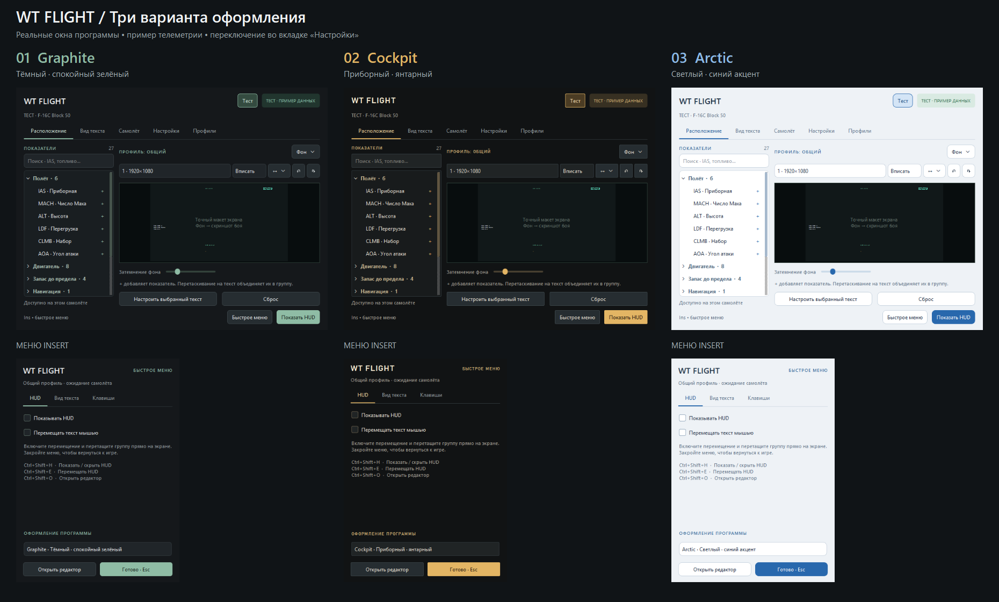
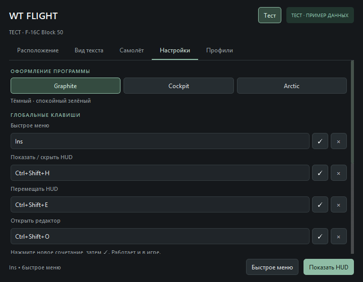

# WT Flight Assistant

Настраиваемый телеметрический HUD для авиарежимов **War Thunder** на Windows. Программа получает данные из локального API игры `127.0.0.1:8111` и показывает выбранные параметры поверх игры в стиле WTRTI.

[](https://github.com/aelz1233/WTTool/releases)
[](https://github.com/aelz1233/WTTool/actions/workflows/ci.yml)
[](LICENSE)

## Скачать

**[Скачать WT Flight Assistant v1.0.9](https://github.com/aelz1233/WTTool/releases/download/v1.0.9/WT-Flight-Setup-1.0.9.exe)** · [Все релизы](https://github.com/aelz1233/WTTool/releases)

Установщик создаёт папку `D:\WT Flight`, ярлык на рабочем столе и необходимые каталоги. В программе есть проверка обновлений и установка новой версии прямо из приложения.

## Возможности

- HUD поверх игры с drag-and-drop редактором и свободным размещением групп.
- Выделение нескольких блоков, изменение размера, выравнивание, привязка, Undo/Redo и Delete.
- IAS, TAS, Mach, высота, перегрузка, AoA, набор высоты, топливо и параметры каждого двигателя.
- Автоопределение самолёта и вертолёта через API игры.
- Пределы IAS/Mach/G, предупреждения с миганием жёлтым и красным цветом.
- Настраиваемые звуки и загрузка собственных WAV-файлов.
- Профили, импорт/экспорт, перезапись и удаление конфигов.
- Быстрое меню по `Insert` и редактируемые горячие клавиши.
- Темы Graphite, Cockpit, Arctic, Dark и Rose.
- Английский интерфейс по умолчанию и переключение на русский.

## Примеры





## Использование

1. Запустите War Thunder в оконном или borderless-режиме.
2. Откройте игру в бою или пробном вылете.
3. Запустите WT Flight Assistant.
4. Добавьте показатели в редакторе и нажмите **Show HUD**.
5. Используйте `Insert`, чтобы открыть меню настроек поверх игры.

Для работы внешнего HUD нужен оконный или borderless-режим. В эксклюзивном полноэкранном режиме Windows-оверлей может не отображаться.

## Запуск из исходников

```powershell
python -m venv .venv
.\.venv\Scripts\python.exe -m pip install -r requirements.txt
.\.venv\Scripts\python.exe -m wtflight
```

Проверки:

```powershell
.\.venv\Scripts\python.exe -m unittest discover -s tests -t . -v
.\.venv\Scripts\python.exe -m wtflight --self-check audit_artifacts\self-check
```

Сборка установщика выполняется на Windows командой `.\packaging\build.ps1`. Подробная инструкция находится в [`packaging/BUILDING.md`](packaging/BUILDING.md).

## Структура

```text
wtflight/
├── core/       логика телеметрии, профилей, топлива и предупреждений
├── services/   API игры, звук и обновления
├── win32/      глобальные клавиши и Windows-интеграция
├── ui/         редактор, HUD, быстрое меню и диалоги
└── resources/  база самолётов, фон и иконка
tests/          автоматические тесты
tools/          инструменты сборки и превью
packaging/      PyInstaller и Inno Setup
```

Для старых ярлыков сохранён небольшой запускатель `wt_assistant.py`; весь исходный код находится в пакете `wtflight`.

## API и данные

Программа читает только локальные endpoints War Thunder:

- `/state` — состояние самолёта, скорость, высота, перегрузка, топливо и двигатели;
- `/indicators` — тип техники, индикаторы и навигация;
- GitHub Releases API — только проверка версии и скачивание обновления по запросу пользователя.

Файлы игры, память процесса и сетевой трафик War Thunder не изменяются. Настройки хранятся в `%APPDATA%\WTFlightAssistant`.

Стрелка направления летящей ракеты не реализована: локальный API не сообщает надёжно направление угрозы и её цель.

## English

WT Flight Assistant is a configurable Windows telemetry HUD for War Thunder. It reads the local game API at `127.0.0.1:8111` and displays selected flight data in a WTRTI-inspired overlay.

It includes drag-and-drop HUD editing, multi-engine telemetry, aircraft and helicopter profiles, limits and warnings, custom sounds, themes, hotkeys, an aircraft database, and in-app GitHub updates.

Download the latest installer from the [GitHub Releases](https://github.com/aelz1233/WTTool/releases) page. The source code is released under the [MIT License](LICENSE); the bundled flight-model database keeps its own license in `wtflight/resources/flight_models/LICENSE`.
